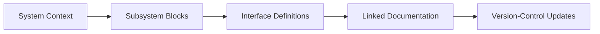

# Fusion System Blocks

## Overview

Fusion System Blocks is a visual systems-documentation workflow built around Autodesk Fusion. It provides a structured way to represent subsystem boundaries, interfaces, and hierarchy during multidisciplinary design. The framework keeps documentation aligned with engineering development.

## Problem

Complex projects can lose traceability between mechanical, electrical, and controls decisions when documentation is fragmented.

## System Architecture

The framework uses top-level system blocks, subsystem decomposition, and explicit interface documentation.

## Key Design Decisions

- **Decision:** Use top-down decomposition.
  **Rationale:** Keep architecture discussions aligned across disciplines.
- **Decision:** Use reusable templates.
  **Rationale:** Reduce format drift and setup time.
- **Decision:** Keep documentation in version control.
  **Rationale:** Track architecture changes with project history.

## Implementation

- Built starter templates for system maps and subsystem hierarchy.
- Added interface documentation patterns tied to markdown notes.
- Integrated visual system mapping with repository documentation workflows.

### Artifacts

- Block library examples: (TBD: add image in `assets/images/projects/fusion-system-blocks/`)
- Interface mapping example: (TBD: add image in `assets/images/projects/fusion-system-blocks/`)

## Lessons Learned

- Lightweight structure is easier to maintain during active development.
- Explicit interface boundaries reduce integration ambiguity.
- Shared visual vocabulary improves review and onboarding.

---

**Project Status:** Public Release | **Timeline:** 2023 - 2024

[← Previous: ST-Link Mods]({{ '/projects/stlink-v3mods/' | relative_url }}) | [Back to Projects →]({{ '/projects/' | relative_url }})
