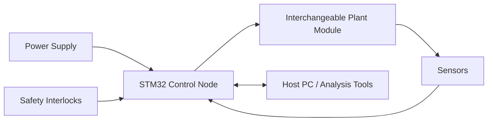

# PID Trainer & Lab Module: Control Systems Education Platform

## Overview

The PID Trainer is a hands-on controls platform that links classroom PID concepts with physical plant behavior. It combines a real-time embedded controller, interchangeable plant modules, and software analysis tools. The platform is structured for repeatable laboratory exercises and tuning workflows.

## Problem

Simulation-only coursework can hide real system effects such as noise, saturation, and setup constraints. This project addressed the need for practical control labs on physical hardware.

## System Architecture

## Interfaces

- **Power interfaces:** Lab supply and local distribution rails (TBD: verify input and rail details).
- **Data interfaces:** Embedded controller to host tooling for logging/analysis (MATLAB/Simulink and Python workflows mentioned in repo content).
- **Control interfaces:** Closed-loop control outputs and sensor feedback paths between controller and plant modules (TBD: verify exact signal list).

## Key Design Decisions

- **Decision:** Use modular plant modules with a common controller base.
  **Rationale:** Reuse control infrastructure across multiple process examples.
- **Decision:** Keep real-time control on embedded hardware.
  **Rationale:** Expose practical constraints during tuning and verification.
- **Decision:** Integrate DAQ and analysis workflows.
  **Rationale:** Reduce friction between experiment execution and interpretation.
- **Decision:** Include lab safety interlocks in baseline architecture.
  **Rationale:** Support repeatable student use with controlled failure behavior.

## Implementation

- Built plant modules for thermal, fluid, and mechanical control exercises.
- Integrated firmware for closed-loop control, logging, and host communications.
- Developed lab exercises covering PID term effects, tuning comparisons, and disturbance response.
- Combined physical experiments with simulation/notebook analysis workflows.

### Artifacts

- Controller PCB layout: (TBD: add image in `assets/images/projects/pid-trainer/`)
- Plant module assembly photo: (TBD: add photo in `assets/images/projects/pid-trainer/`)
- Schematic excerpt: (TBD: add image in `assets/images/projects/pid-trainer/`)
- Bench test setup: (TBD: add photo in `assets/images/projects/pid-trainer/`)

## Testing & Verification

- Power bring-up checklist (TBD: add)
- Sensor and actuator interface validation (TBD: add)
- Closed-loop functional test procedure (TBD: add)
- Lab calibration procedure (TBD: add)

## Lessons Learned

- Pairing model predictions with measured responses improves tuning intuition.
- Standardized module interfaces simplify maintenance and course delivery.
- Calibration and startup steps need explicit documentation for repeatable labs.
- (TBD: add one real integration issue encountered and resolution)

---

**Project Status:** Active Deployment | **Timeline:** September 2020 - Present

[← Previous: Smart Home]({{ '/projects/smart-home-system/' | relative_url }}) | [Next Project: ST-Link Mods →]({{ '/projects/stlink-v3mods/' | relative_url }})
