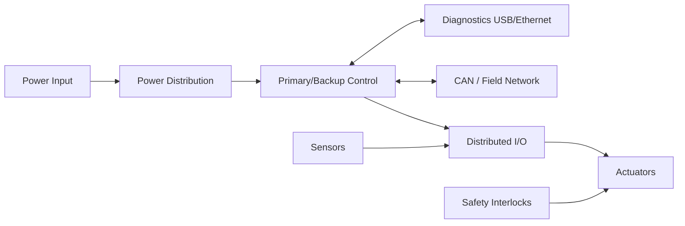

# Sentry V3: Production Embedded Actuation System

## Overview

Sentry V3 is an embedded electromechanical actuation platform for rugged automation use. It combines custom control electronics, safety logic, field communications, and a sealed mechanical enclosure. The design supports modular channel configuration and integration with existing automation infrastructure.

## Problem

The project addressed replacement of legacy pneumatic actuation hardware where deterministic control, safety interlocks, and maintainability were required.

## System Architecture

## Interfaces

- **Power interfaces:** Power input to isolated conversion and local distribution rails (TBD: verify input range and rail map).
- **Data interfaces:** CANopen and Modbus TCP noted in project documentation; local diagnostics over USB/Ethernet.
- **Control interfaces:** Distributed digital/analog I/O and safety interlock paths (TBD: verify final signal map).

## Key Design Decisions

- **Decision:** Use dual-redundant control topology.
  **Rationale:** Maintain control-path availability during faults.
- **Decision:** Use distributed I/O rather than centralized wiring.
  **Rationale:** Reduce harness complexity and improve field serviceability.
- **Decision:** Use hardware-level safety interlocks independent of application code.
  **Rationale:** Preserve emergency behavior if firmware control degrades.
- **Decision:** Use sealed die-cast enclosure architecture.
  **Rationale:** Match environmental and mounting constraints from requirements.

## Implementation

- PCB development with isolated power domains, transceiver protection, and manufacturing test access.
- RTOS firmware with state-machine control, watchdog supervision, and fault handling.
- Model-based and hardware-in-the-loop validation during control development.
- Manufacturing handoff planning for in-circuit testing, coating workflow, and traceability.

### Artifacts

- PCB layout screenshot: (TBD: add image in `assets/images/projects/sentry-v3/`)
- Schematic excerpt: (TBD: add image in `assets/images/projects/sentry-v3/`)
- Bench test setup: (TBD: add photo in `assets/images/projects/sentry-v3/`)
- CAD assembly: (TBD: add image in `assets/images/projects/sentry-v3/`)

## Testing & Verification

- Power bring-up checklist (TBD: add)
- Interface validation for CAN/diagnostics and distributed I/O (TBD: add)
- Functional test procedure for actuation and safety states (TBD: add)
- Environmental and reliability verification workflow (TBD: add)

## Lessons Learned

- Designing for testability early simplified manufacturing ramp and debug.
- Serviceability constraints should be defined before connector and enclosure lock-in.
- Separating safety pathways from application logic reduced integration risk across revisions.
- (TBD: add one real integration issue encountered and resolution)

---

**Project Status:** Production Deployment | **Timeline:** January 2023 - March 2024

[← Back to Projects]({{ '/projects/' | relative_url }}) | [Next Project: Surfer Fleet →]({{ '/projects/surfer-fleet/' | relative_url }})
