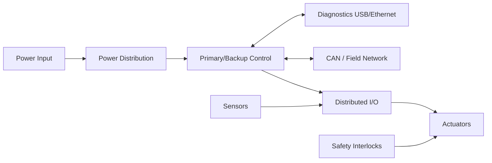

# Sentry V3: Production Embedded Actuation System

## Overview

SENTRY V3 is an embedded electromechanical platform that integrates sensing, actuation, and control for a pan-tilt robotic turret system. The platform combines custom motor control electronics, sensor interfaces, and embedded firmware to coordinate flywheel propulsion, ammunition feeding, and two-axis positioning. The design supports modular expansion and allows higher-level compute systems to command the platform while the embedded controller handles real-time motor control and safety behavior.

## Problem

Earlier versions of the platform relied on ad-hoc wiring and distributed control logic, which made integration, testing, and debugging difficult. The V3 design consolidates motor control, sensor interfaces, and safety handling into a dedicated embedded controller, creating a more maintainable architecture for experimentation and development.

## System Architecture

## Interfaces

- **Power interfaces:** Single DC input supplying the platform, with onboard regulation providing local 5 V and 3.3 V rails for logic, sensors, and motor drivers.
- **Data interfaces:** I²C bus for onboard sensors and analog expansion, along with USB or serial communication to an external host computer used for higher-level control and perception.
- **Control interfaces:** PWM and digital GPIO used for motor drivers and actuators, with additional GPIO inputs for system triggers and safety control.

## Key Design Decisions

- **Decision:** Separate high-level control from real-time motor control.
  **Rationale:** Allow external compute systems to handle perception and targeting while the embedded controller manages timing-critical motor control and safety behavior.
- **Decision:** Use a microcontroller-based control board (RP2040) for actuator coordination.
  **Rationale:** Provide deterministic timing for motor control, sensor polling, and actuator sequencing without relying on a general-purpose host computer.
- **Decision:** Place sensors and auxiliary devices on a shared I²C bus.
  **Rationale:** Reduce wiring complexity and allow new sensors to be added without redesigning the control architecture.
- **Decision:** Use discrete motor drivers for pan, tilt, flywheel, and feed mechanisms.
  **Rationale:** Allow each subsystem to be controlled and tuned independently while simplifying debugging during bring-up.
- **Decision:** Integrate current monitoring on the flywheel drive.
  **Rationale:** Detect projectile events through current spikes, enabling reliable shot counting without additional sensors.

## Implementation

- Custom control PCB integrating motor drivers, sensor interfaces, and power regulation for turret subsystems.
- Embedded firmware running on the RP2040 that coordinates flywheel spin-up, ammunition feed control, and pan–tilt positioning.
- I²C sensor integration for orientation and system monitoring, with current sensing used to detect projectile events during firing.
- Integration with an external compute platform responsible for vision processing and target selection while the embedded controller manages real-time actuation.
- Bench testing and bring-up performed using logic analysis, current monitoring, and iterative firmware tuning.

### Artifacts

- PCB layout screenshot: (TBD: add image in `assets/images/projects/sentry-v3/`)
- Schematic excerpt: (TBD: add image in `assets/images/projects/sentry-v3/`)
- Bench test setup: (TBD: add photo in `assets/images/projects/sentry-v3/`)
- CAD assembly: (TBD: add image in `assets/images/projects/sentry-v3/`)

## Testing & Verification

- Power bring-up checklist (TBD: add)
- Interface validation for CAN/diagnostics and distributed I/O (TBD: add)
- Functional test procedure for actuation and safety states (TBD: add)
- Environmental and reliability verification workflow (TBD: add)

## Lessons Learned

- Separating high-level control from real-time actuation simplifies system behavior and makes debugging significantly easier.
- Current sensing can serve as a reliable proxy for mechanical events when adding dedicated sensors would increase complexity.
- Integrating multiple motor-driven subsystems requires careful sequencing and state management to prevent unexpected interactions between actuators.
- Early bring-up instrumentation (current monitoring, logic analysis, and serial diagnostics) greatly reduces iteration time during firmware development.
- Designing the control board with spare interfaces and expansion capability makes it easier to add sensors and experiment with new control strategies.

---

**Project Status:** Production Deployment | **Timeline:** January 2024 - December 2025

[← Back to Projects]({{ '/projects/' | relative_url }}) | [Next Project: Surfer Fleet →]({{ '/projects/surfer-fleet/' | relative_url }})
