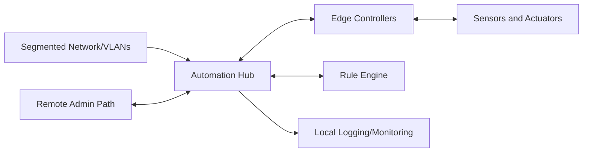

# Smart Home System: Safety-First IoT Architecture

## Overview

This project is a residential automation system built around safety, security, and local control. It integrates segmented networking, distributed device control, and event-driven automation for environmental and security functions. The implementation prioritizes maintainability and predictable behavior under degraded conditions.

## Problem

Typical home automation deployments can mix critical and non-critical traffic on flat networks and depend heavily on cloud services. The engineering need was to isolate critical functions and keep core control local.

## System Architecture

## Interfaces

- **Power interfaces:** Distributed device and controller power domains (TBD: verify distribution map).
- **Data interfaces:** Local network interfaces across segmented VLANs; local telemetry/logging paths.
- **Control interfaces:** Event-driven automation and scheduling control through Node-RED/Home Assistant stack.

## Key Design Decisions

- **Decision:** Use VLAN-based segmentation.
  **Rationale:** Isolate critical services from general automation traffic.
- **Decision:** Keep core processing local-first.
  **Rationale:** Maintain essential functions during external connectivity loss.
- **Decision:** Use layered security controls.
  **Rationale:** Combine policy enforcement, authentication, and monitoring.
- **Decision:** Define fail-safe automation states.
  **Rationale:** Keep system behavior predictable during faults.

## Implementation

- Built segmented network and baseline security policy.
- Integrated environment, security, and utility devices into one control model.
- Implemented event-driven logic and scheduling using Node-RED and Home Assistant.
- Added local logging and dashboard workflows for diagnostics and maintenance.

### Artifacts

- Network topology diagram: (TBD: add image in `assets/images/projects/smart-home-system/`)
- Automation flow screenshot: (TBD: add image in `assets/images/projects/smart-home-system/`)
- Device cabinet photo: (TBD: add photo in `assets/images/projects/smart-home-system/`)
- Bench validation setup: (TBD: add photo in `assets/images/projects/smart-home-system/`)

## Testing & Verification

- Network segmentation validation checklist (TBD: add)
- Device interface validation (TBD: add)
- Automation functional test procedure (TBD: add)
- Fault/degraded-mode behavior checks (TBD: add)

## Lessons Learned

- Standardized device onboarding and naming improves maintainability.
- Observability tooling is required for diagnosing multi-device automation issues.
- Security and safety checks should be part of every new automation change.
- (TBD: add one real integration issue encountered and resolution)

---

**Project Status:** Production Operation | **Timeline:** March 2021 - Present

[← Previous: Surfer Fleet]({{ '/projects/surfer-fleet/' | relative_url }}) | [Next Project: PID Trainer →]({{ '/projects/pid-trainer/' | relative_url }})
