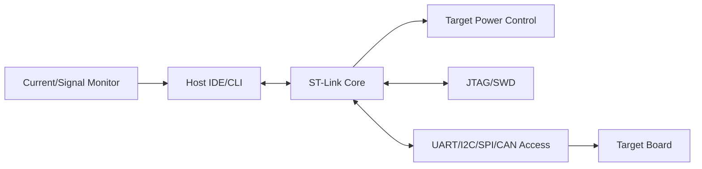

# ST-Link V3 Modifications: Enhanced Developer Tooling

## Overview

This project extends ST-Link V3 hardware into a wider embedded development interface board. It adds power control, protocol breakout, and monitoring paths while keeping standard debug workflows intact. The goal is to reduce bring-up friction during firmware and hardware development.

## Problem

The base debug probe did not expose all interfaces needed for routine board bring-up and protocol troubleshooting, resulting in fragmented tooling and setup overhead.

## System Architecture

## Interfaces

- **Power interfaces:** Target power switching/measurement path (TBD: verify supported voltage/current range).
- **Data interfaces:** JTAG/SWD plus UART/I2C/SPI/CAN breakout noted in page content.
- **Control interfaces:** Scriptable command path for power and interface operations (TBD: verify command coverage).

## Key Design Decisions

- **Decision:** Preserve baseline ST-Link compatibility.
  **Rationale:** Keep existing debug workflow usable without retraining.
- **Decision:** Integrate power control and monitoring.
  **Rationale:** Improve bring-up and fault isolation on target boards.
- **Decision:** Extend firmware with protocol-aware features.
  **Rationale:** Reduce dependence on separate external tools.
- **Decision:** Provide scriptable command surface.
  **Rationale:** Support repeatable debug and validation procedures.

## Implementation

- Added board-level current-sensing, protection, and power-cycling circuitry.
- Implemented firmware command extensions for power and interface operations.
- Integrated protocol-monitoring features into host development workflow.
- Built command-line and IDE usage patterns for repeatable debugging.

### Artifacts

- Breakout board layout: (TBD: add image in `assets/images/projects/stlink-v3mods/`)
- Schematic excerpt: (TBD: add image in `assets/images/projects/stlink-v3mods/`)
- Firmware interface map: (TBD: add image in `assets/images/projects/stlink-v3mods/`)
- Bench bring-up photo: (TBD: add photo in `assets/images/projects/stlink-v3mods/`)

## Testing & Verification

- Power-path bring-up checklist (TBD: add)
- Protocol interface validation (TBD: add)
- Debug workflow regression checklist (TBD: add)
- Firmware command verification procedure (TBD: add)

## Lessons Learned

- Backward compatibility is essential when extending established debug tools.
- Integrated power sequencing and bus visibility reduces bring-up time and ambiguity.
- Modular firmware command design improves maintainability of feature additions.
- (TBD: add one real integration issue encountered and resolution)

---

**Project Status:** Prototype Deployment | **Timeline:** May 2022 - December 2023

[← Previous: PID Trainer]({{ '/projects/pid-trainer/' | relative_url }}) | [Next Project: Fusion Blocks →]({{ '/projects/fusion-system-blocks/' | relative_url }})
