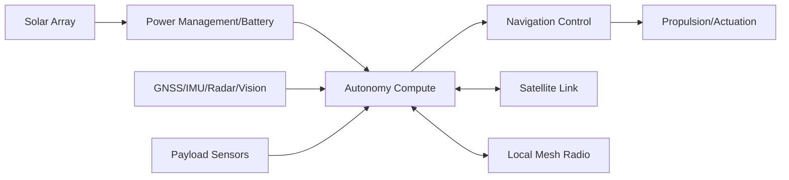

# Autonomous Surfer Fleet: Maritime Autonomy Platform

## Overview

The Surfer Fleet project is an autonomous surface-vehicle platform for long-duration maritime monitoring. It combines energy management, onboard autonomy, and remote telemetry in a modular mission architecture. The platform supports payload integration and coordinated multi-vehicle operation.

## Problem

The system was developed for monitoring missions where crewed vessel operations are expensive and difficult to sustain, requiring robust autonomy and communications in marine conditions.

## System Architecture

## Interfaces

- **Power interfaces:** Solar input, battery storage, onboard distribution (TBD: verify rail map and protection details).
- **Data interfaces:** Satellite telemetry path and local mesh networking for command/data exchange.
- **Control interfaces:** Navigation/mission control outputs to propulsion and mission subsystems (TBD: verify actuator interface details).

## Key Design Decisions

- **Decision:** Use hybrid solar-battery power architecture.
  **Rationale:** Support extended missions without constant shore-side intervention.
- **Decision:** Split autonomy into layered control behaviors.
  **Rationale:** Separate fast-response safety actions from higher-level mission planning.
- **Decision:** Use satellite + mesh communications.
  **Rationale:** Maintain remote telemetry while enabling local fleet coordination.
- **Decision:** Keep payload interface modular.
  **Rationale:** Enable sensor changes without redesigning core control hardware.

## Implementation

- Integrated onboard power subsystem with charging, storage, and power-budget logic.
- Built navigation stack from sensor fusion, route planning, and collision-avoidance components.
- Implemented telemetry/command pathways across satellite and local radio links.
- Used simulation, HIL workflows, controlled-water tests, and field-trial iterations.

### Artifacts

- Hull/platform photo: (TBD: add image in `assets/images/projects/surfer-fleet/`)
- Electronics layout: (TBD: add image in `assets/images/projects/surfer-fleet/`)
- Bench integration setup: (TBD: add photo in `assets/images/projects/surfer-fleet/`)
- Field test setup: (TBD: add photo in `assets/images/projects/surfer-fleet/`)

## Testing & Verification

- Power and energy-budget validation checklist (TBD: add)
- Navigation sensor interface validation (TBD: add)
- Telemetry/command link validation (TBD: add)
- Mission-function verification procedure (TBD: add)

## Lessons Learned

- Marine power and communications should be designed as one coupled system.
- Explicit separation of vehicle-level and fleet-level control improves maintainability.
- Embedded diagnostics and recovery paths are critical for remote operations.
- (TBD: add one real integration issue encountered and resolution)

---

**Project Status:** Active Deployment | **Timeline:** June 2022 - Present

[← Previous: Sentry V3]({{ '/projects/sentry-v3/' | relative_url }}) | [Next Project: Smart Home →]({{ '/projects/smart-home-system/' | relative_url }})
