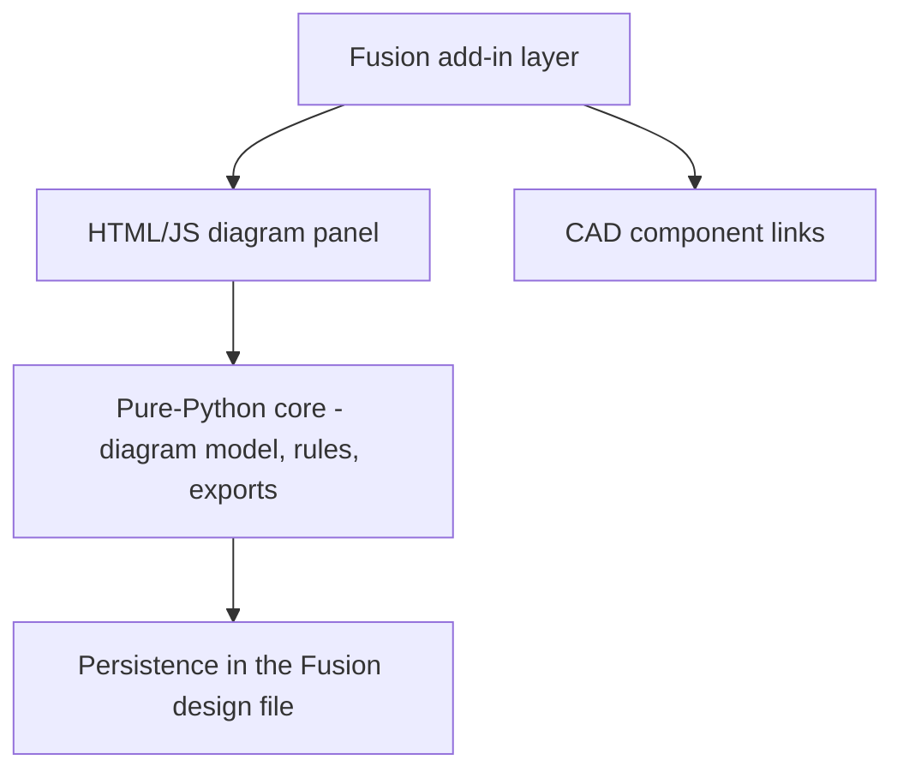

# Fusion System Blocks

## At a glance

- Autodesk Fusion add-in — a system block-diagram editor inside the CAD environment
- Diagrams are saved inside the Fusion design file, next to the 3D model
- Blocks link to real CAD components (name, material, and mass carried into the diagram)
- 775 passing Python tests, 24 JavaScript harness tests, and 30 in-app diagnostic checks
- 11 export formats, including PDF report, BOM, connection matrix, and SVG
- [View source on GitHub](https://github.com/zcohen-nerd/Fusion_System_Blocks) · [Download the latest release](https://github.com/zcohen-nerd/Fusion_System_Blocks/releases)

## Overview

Fusion System Blocks is an Autodesk Fusion add-in that adds a diagram editor to the CAD environment. You draw blocks for the parts of a product — a motor, a circuit board, a sensor, a piece of firmware — and typed wires between them showing how they connect: power, data, signal, and mechanical linkages. Blocks come in 8 shapes, color-coded as Electrical, Mechanical, Software, or Generic, and each block tracks an implementation state from Placeholder through Planned, In-Work, Implemented, and Verified.

The diagram is stored inside the Fusion design file itself. Anyone who opens the design sees both the physical model and the system plan in one place — no separate Visio or PowerPoint file drifting out of sync with the CAD.

## Problem

System architecture usually lives outside the CAD environment — in slide decks, whiteboard photos, or diagramming tools that have no connection to the actual design. As the mechanical model evolves, those diagrams silently go stale, and the interfaces between subsystems (the place integration problems are born) stop being visible to the people making design decisions. Fusion System Blocks keeps the architecture in the same file as the geometry, linked to the real components.

## Product Architecture

The application is layered so the diagram logic stays independent of Fusion itself:

- **Fusion add-in layer** (`fusion_addin/`, `Fusion_System_Blocks.py`) — toolbar command, palette hosting, and all Fusion API interaction.
- **Diagram panel** (`src/`) — a plain HTML/JavaScript canvas UI: blocks, wires, pages, groups, keyboard shortcuts, and inline help.
- **Python core** (`fsb_core/`, `src/diagram/`) — the diagram model, rule engine, and export subsystem, written as pure Python with no Fusion dependencies so it can be tested outside the CAD environment.
- **Persistence** — diagrams serialize into the open Fusion design; named diagrams allow multiple variants ("Concept A", "Concept B") in one design file.

## Core Interfaces

- **Fusion toolbar** — the System Blocks command under Utilities → Add-Ins opens the panel in the Design workspace.
- **Diagram panel** — block/wire editing, pages for large systems, nested child diagrams with drill-down, groups, and net labels that connect by name like schematic nets.
- **Link to CAD** — associates a block with a component in the 3D model; the block displays the component's name and carries its material and mass.
- **Rule checks** — "Check Rules" scans for unconnected blocks, voltage mismatches, over-budget power draw (driven by block attributes like `current`, `voltage`, and `output_current`), and default-named blocks.
- **Snapshots** — save points with notes; any snapshot can be restored, and two snapshots can be diffed to see what was added, removed, or changed.
- **Exports** — 11 formats including a PDF report, bill of materials, connection matrix, and SVG, written to a user-selected folder.
- **Diagnostics and logging** — a Run Diagnostics command executes 30 built-in self-checks, and the add-in writes session logs for bug reports.

## Key Design Decisions

- **Decision:** Keep the diagram core as pure Python with no Fusion dependencies.
  **Rationale:** The model, rule engine, and exports can be exercised by 775 automated tests without launching CAD, and the Fusion layer stays thin.
- **Decision:** Store diagrams inside the Fusion design rather than as sidecar files.
  **Rationale:** The architecture travels with the model — sharing the design shares the system plan, with no second artifact to version.
- **Decision:** Use typed connections and block attributes rather than free-form drawing.
  **Rationale:** Typed data is what makes rule checking possible — voltage mismatch and power-budget analysis need semantics, not pictures.
- **Decision:** Net labels for long-distance connections.
  **Rationale:** Large diagrams stay readable; blocks sharing a label (like `5V`) count as connected, matching electronics-schematic conventions.

## Implementation

The add-in ships as a standard Fusion add-in folder installed through Fusion's Scripts and Add-Ins dialog — no other software required, on Windows 10/11 or macOS. Day-to-day editing is keyboard-driven (connect, group, page, undo/redo, fit-view), with an in-panel shortcut reference and built-in help guide.

## Verification & Diagnostics

Three distinct layers of verification exist, and they are different things:

- **Automated tests** — 775 passing Python tests (pytest, including property-based tests via Hypothesis) covering the core model, rules, and exports, plus 24 JavaScript harness tests for the panel — runnable without Fusion.
- **In-app diagnostics** — 30 self-checks runnable from inside Fusion to verify an installation without touching the user's design.
- **Manual validation** — a documented manual regression plan and a release-validation checklist are maintained in the repository and executed against the Fusion environment for releases.

## Release Status

**Public Beta.** The current release is [v0.1.1](https://github.com/zcohen-nerd/Fusion_System_Blocks/releases) — an initial public release that works well for personal and school projects, with expected rough edges; the project's own guidance is to keep backups of important work. Source is available under the Fusion System Blocks Community License for personal, academic, and non-commercial use; commercial use requires a paid license.

## Lessons Learned

- Separating the diagram core from the CAD integration made the difference between a testable product and a demo — the majority of the test suite runs with no Fusion installed.
- Typed data earns its friction: rule checking, exports, and CAD links all fall out of blocks carrying real attributes instead of being drawings.
- Persisting into the host document removes an entire class of sync problems, at the cost of teaching users that two saves (panel and Fusion) both matter.

---

**Project Status:** Public Beta | **Timeline:** 2025–Present

[← Previous: SPARK Programming Board](/projects/stlink-v3mods/) | [Back to Projects](/projects/)
