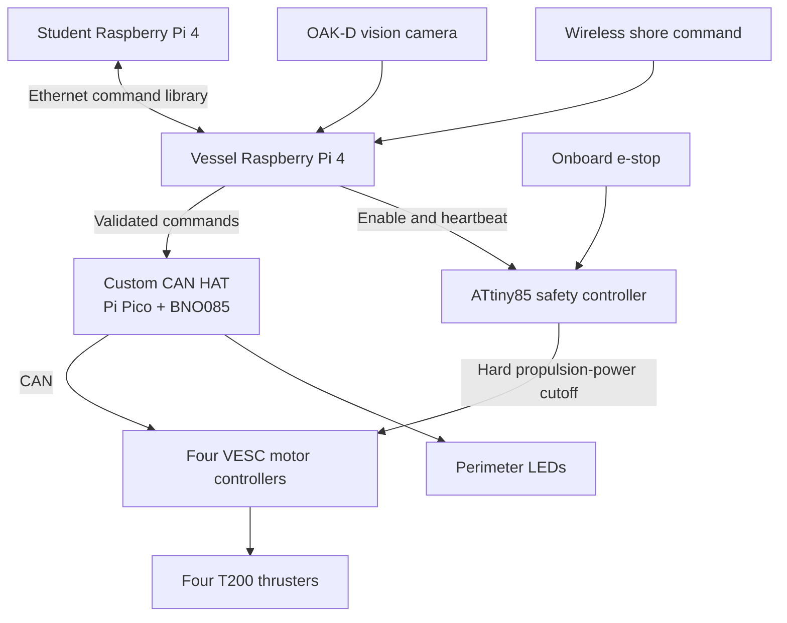

# SURFER Fleet: Holonomic Autonomous Surface Vessels

<em>A redesigned SURFER vessel on the water during testing.</em>

## At a glance

- 20-vessel research fleet, including 10 vessels used concurrently in a Spring 2026 course
- Four Blue Robotics T200 thrusters providing independent surge, sway, and yaw control
- Dual–Raspberry Pi 4 architecture separating protected vessel control from student software
- Four custom circuit boards for battery monitoring, safety control, power distribution, and CAN-connected sensing
- One-piece, watertight SLA hull reduced fabrication time from 13 days to approximately 14 hours
- Per-hull fabrication cost reduced from approximately $2,500 to $400, with print failures reduced from roughly 70% to 10%

## Overview

SURFER is a fleet of 20 small holonomic autonomous surface vessels developed at the U.S. Naval Academy for scaled maritime autonomy and multi-agent robotics research. Unlike a conventional boat with a fixed bow and primary direction of travel, each SURFER can translate in any horizontal direction, rotate in place, or translate while rotating. This gives the research software enough control authority to emulate the behavior of different vessel types rather than locking every experiment to one physical hull configuration.

The project began in 2020 with a proof-of-concept vessel. I took ownership of the design in 2024 and redesigned the complete platform: system architecture, component selection, mechanical integration, wiring, custom circuit boards, power distribution, firmware, and initial fabrication. Other technicians performed the fleet's bulk fabrication and assembly, while professors developed the higher-level vessel and research software.

The first redesigned vessel deployed successfully in 2025. A ten-vessel classroom fleet was subsequently operated concurrently during the Spring 2026 semester.

## Problem

The original SURFER proved that the research concept could work, but its manufacturing process could not support a fleet. Its complex FDM-printed PLA hull had an approximately 70% print-failure rate and took 13 days to manufacture. Because PLA is not inherently watertight, each completed print then required more than a day of hands-on finishing and approximately two weeks at an external vendor for gel coating. The resulting hull cost approximately $2,500.

That process could produce a prototype. It could not reasonably produce 20 repeatable research vessels.

The redesign therefore had to solve more than hull fabrication. It needed repeatable propulsion and handling, standardized electronics, a safe boundary between student code and vessel control, reliable fleet-level position tracking, and a serviceable power and safety architecture. Differences that are tolerable on one prototype become 20 separate debugging problems when reproduced across a fleet.

## Manufacturing Redesign

I redesigned the hull around the build envelope of the Formlabs Form 3L and, later, the Form 4L. The resulting hull prints as a single 11.25-inch-square SLA component with a removable laser-cut acrylic lid. The bare hull is 7.2 inches tall, the complete vessel is 8.476 inches tall, and the assembled system weighs approximately 20 pounds.

Tough 2000 Resin was initially evaluated for the hull, but its warp rate made it untenable for a part this large. The production design moved to Grey Resin, which provided a dimensionally stable and watertight hull without coating or other sealing post-processing. On the Form 4L, hull fabrication dropped from 13 days to approximately 14 hours. The failure rate fell from roughly 70% to 10%, hands-on post-processing dropped to approximately one hour, and per-hull fabrication cost fell from approximately $2,500 to $400 in resin.

The enclosure was designed around minimizing leak paths. It has only five external penetrations: four Blue Robotics bulkheads for the thrusters and one opening for the top-mounted OAK-D vision camera. Serviceable joints use redundant O-rings; permanent joints use liquid gasket. An O-ring groove molded into the SLA hull seals the removable acrylic lid as screws apply the required clamping force.

A clear SLA-printed ring forms part of the upper enclosure. Independently addressable LEDs illuminate the full perimeter through this ring, giving the software a configurable operator-feedback interface for vessel identity, heading, operating state, emergency-stop indication, or experiment-specific visualization.

**Complete vessel CAD model**

## Holonomic Propulsion

Four Blue Robotics T200 thrusters are arranged in a clockwise tangential pattern around the vessel's perimeter. Because each thruster is independently reversible, the control system can combine their outputs to command surge, sway, and yaw independently, including translation and rotation at the same time.

The original design direction used Blue Robotics electronic speed controllers, but their low-speed behavior was not adequate for precise maneuvering. The propulsion system was changed to four individual VESC-based motor controllers. VESC originated as an open-source motor-control platform for electric skateboards, but its low-speed control and CAN interface made it a better fit for this application. Each controller receives commands over the vessel CAN bus from the custom Raspberry Pi HAT.

The long-term research goal is to use this actuation authority to simulate larger vessels at scale. A group of identical SURFER hulls could be assigned different software-defined dynamic behavior—one acting as an aircraft carrier, others as destroyers or supporting vessels—without building a different physical platform for every vessel class. The redesigned fleet established the hardware capability for that research; full vessel-class emulation remained future work.

## Control Architecture

The vessel uses two Raspberry Pi 4 computers with an explicit authority boundary:

- **Vessel Raspberry Pi:** Owns vessel commands, safety coordination, CAN communication, and OAK-D vision processing. It validates requested motion before implementing it.
- **Student Raspberry Pi:** Provides the student development environment. A software library allows student code to request vessel motion over Ethernet without giving it direct control of the propulsion hardware.

This separation lets students work with a real multi-axis vessel while the system-owned computer retains control of command validation and propulsion enablement. The professors developed the Raspberry Pi software and student-facing command library; I designed the hardware architecture and developed the embedded firmware used by the custom electronics.

## Custom Electronics

Four custom circuit boards support the vessel architecture:

### Battery monitor and vessel-Pi supply

The fleet uses 18 V nominal DeWalt tool batteries. Those packs rely on the host tool for system-level low-voltage handling, so the vessel required its own voltage monitoring. The custom battery board reports a low-voltage condition to the control system and includes a dedicated 5 V output for the vessel Raspberry Pi. It reports the condition rather than physically disconnecting the battery.

### Safety-relay controller

An ATtiny85-based safety board latches the propulsion relay, interprets commands from the vessel Pi, monitors its heartbeat, debounces the physical emergency-stop input, and controls the external warning light. Propulsion defaults to disabled at startup and remains unavailable until explicitly enabled.

Either the onboard physical e-stop or a wireless shore-side command can disable propulsion. The safety relay removes power only from the thrusters and motor controllers; both Raspberry Pis, communications, sensing, and other internal electronics remain powered. This preserves telemetry and diagnostic access while placing the hazardous energy domain in a known safe state.

### Power distribution

The power architecture separates propulsion from the vessel's low-voltage electronics. The battery-monitor board supplies the vessel Pi, the perimeter LEDs use a dedicated converter, and a third converter supplies the remaining electronics. Separating these loads prevents the LED system and research electronics from sharing the vessel computer's supply path.

### Raspberry Pi CAN HAT

The custom vessel-Pi HAT provides the CAN interface used to command the four VESC motor controllers. It also integrates a BNO085 inertial measurement unit and a Raspberry Pi Pico. The Pico handles IMU acquisition and the perimeter's independently addressable LEDs, tasks better suited to a microcontroller than to timing-dependent control from Linux on the Pi 4.

## Research Interfaces

- **Motion tracking:** A standardized plate on the top of each vessel carries OptiTrack markers, allowing the motion-capture system to track the fleet and report each vessel's position and orientation.
- **Vision:** An OAK-D camera is installed on every vessel and processed by the vessel Raspberry Pi.
- **Internal networking:** Ethernet connects the student and vessel Raspberry Pis.
- **Vehicle communications:** Wi-Fi supports vessel communication and the shore-side safety command.
- **Embedded interfaces:** CAN connects the vessel controller to the four VESCs; GPIO remains available for system integration and research expansion.
- **Operator feedback:** The programmable perimeter LEDs can display heading, vessel identity, e-stop state, or experiment-defined information.

## Key Design Decisions

- **Decision:** Replace the FDM-and-gel-coat hull with a one-piece SLA hull. 
  **Rationale:** The original 13-day, 70%-failure process could not support a 20-vessel build. Large-format SLA reduced fabrication to approximately 14 hours, eliminated outsourced coating, and cut per-hull cost by roughly 84%.
- **Decision:** Use Grey Resin instead of Tough 2000 Resin. 
  **Rationale:** Tough 2000 warped too frequently at the required part size. Grey Resin provided the dimensional stability and as-printed watertightness the enclosure needed.
- **Decision:** Use four tangentially arranged, independently reversible thrusters. 
  **Rationale:** A holonomic platform can reproduce arbitrary planar motion and provides the control authority needed for future software-defined vessel-class behavior.
- **Decision:** Replace the initially planned Blue Robotics ESCs with CAN-connected VESC controllers. 
  **Rationale:** Precise low-speed maneuvering mattered more than nominal component compatibility, and the VESCs provided better low-speed behavior with a native networked control interface.
- **Decision:** Separate student compute from vessel-authority compute. 
  **Rationale:** Students can develop and execute real autonomy code while the vessel Pi independently validates commands and retains control of propulsion and safety.
- **Decision:** Hard-disable propulsion without depowering compute. 
  **Rationale:** An e-stop must remove thrust immediately, but preserving computers, sensing, and communications maintains telemetry and makes the stopped vessel diagnosable.
- **Decision:** Build programmable fleet feedback into the enclosure. 
  **Rationale:** A 20-vessel experiment needs visible identity and state information. The clear perimeter ring turns software state, heading, and safety status into immediate operator feedback.

## Testing and Deployment

Verification covered the failure modes most consequential to a fleet operating on water:

- Enclosure leak testing
- Low-voltage detection
- Physical and wireless emergency-stop operation
- Loss-of-communications behavior
- CAN fault handling
- OptiTrack motion-capture integration
- Multi-vessel operation

The first redesigned vessel deployed at the U.S. Naval Academy in 2025. All major functions operated successfully, but testing identified a small leak at the lid O-ring. The seal itself was not the root problem; the screw pattern did not apply uniform clamping force around the perimeter. The clamping geometry was revised to distribute compression more evenly.

That distinction became one of the project's more useful mechanical lessons: specifying an O-ring does not create a reliable seal. The groove geometry, compression, fastener spacing, and stiffness of the mating components create the seal.

Following the initial deployment and fleet build, ten vessels were operated concurrently as part of a Spring 2026 course. That classroom deployment occurred after my departure from the Naval Academy, so this page does not attribute the course's software or instructional outcomes to my work.

## My Role

I owned the vessel redesign and its systems integration, including:

- Overall system architecture and component selection
- SLA hull and enclosure design
- Mechanical and electrical integration
- Wiring architecture and power distribution
- Design of four custom circuit boards
- Battery-monitor, safety-controller, and CAN-HAT firmware
- Initial fabrication, bring-up, verification, and first-water deployment

Other technicians performed the fleet's bulk fabrication and assembly. Professors developed the higher-level Raspberry Pi software, autonomy tools, and student command library.

## Lessons Learned

- A prototype manufacturing process is not automatically a fleet manufacturing process. The hull redesign was not merely a cost optimization; it was the change that made a 20-vessel program feasible.
- Nominally compatible components still have to perform in the actual operating regime. The planned ESCs could drive the T200 thrusters, but their low-speed response did not satisfy the maneuvering requirement.
- A safety shutdown should remove hazardous energy without destroying observability. Hard-cutting propulsion while leaving compute and communications alive made the vessel both safe and diagnosable.
- Fleet identity and operator feedback need to be part of the platform architecture. The perimeter LEDs and motion-capture plate were system interfaces, not decorative additions.
- Waterproofing is a mechanical load-distribution problem. O-ring material and groove dimensions matter, but they cannot compensate for inadequate or uneven clamping force.

---

**Project Status:** Deployed | **Timeline:** 2020–Present

[← Previous: SENTRY V3](/projects/sentry-v3/) | [Next Project: SPARK Programming Board →](/projects/stlink-v3mods/)
